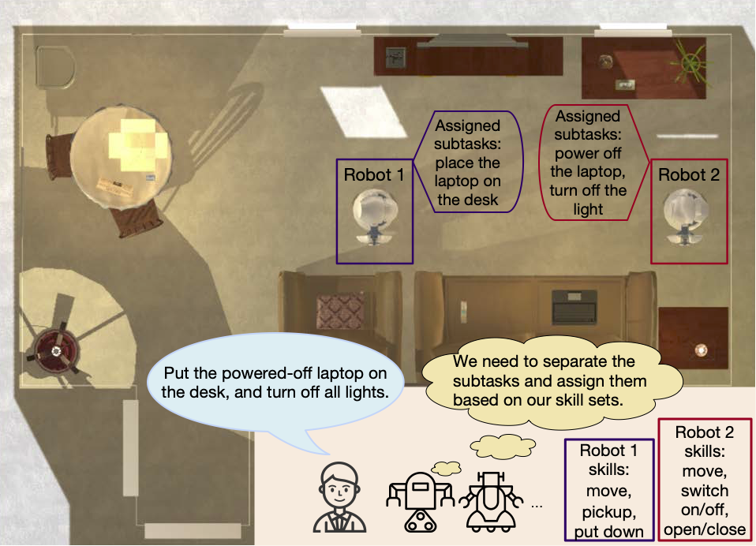

# **LaMMA-P: Generalizable Multi-Agent Long-Horizon Task Allocation and Planning with LM-Driven PDDL Planner**

This is the official repository for the LaMMA-P codebase. It includes instructions for configuring and running LaMMA-P on the MAT-THOR datasets in the AI2-THOR simulator. It is accepted as a conference paper by the IEEE International Conference on Robotics and Automation (ICRA), Atlanta, 2025.


[Project Website](https://lamma-p.github.io/) | [Paper](https://arxiv.org/abs/2409.20560) | [Video](https://www.youtube.com/watch?v=1edDuJbk_uk)



**Abstract:** Language models (LMs) possess a strong capability to comprehend natural language, making them effective in translating human instructions into detailed plans for simple robot tasks. Nevertheless, it remains a significant challenge to handle long-horizon tasks, especially in subtask identification and allocation for cooperative heterogeneous robot teams. To address this issue, we propose a Language Model-Driven Multi-Agent PDDL Planner (LaMMA-P), a novel multi-agent task planning framework that achieves state-of-the-art performance on long-horizon tasks. LaMMA-P integrates the strengths of the LMs’ reasoning capability and the traditional heuristic search planner to achieve a high success rate and efficiency while demonstrating strong generalization across tasks. Additionally, we create MAT-THOR, a comprehensive benchmark that features household tasks with two different levels of complexity based on the AI2-THOR environment. The experimental results demonstrate that LaMMA-P achieves a 105% higher success rate and 36% higher efficiency than existing LM-based multi-agent planners.

## Code Organization
Below are the details of various important directories 
- `resources/`: Contains robot definitions and PDDL domain files
- `scripts/`: Main execution scripts adapted from [SMART-LLM](https://github.com/SMARTlab-Purdue/SMART-LLM)
- `data/`: Test datasets and example tasks extended from [SMART-LLM](https://github.com/SMARTlab-Purdue/SMART-LLM)
- `downward/`: Fast Downward planner from [Fast Downward](https://github.com/aibasel/downward/)

## Datasets
The repository includes various commands and robots with different skill sets for heterogeneous robot tasks:

- Test tasks: `data/final_test/`
- Robot definitions: `resources/robots.py`
- Floor plans: Refer to [AI2Thor Demo](https://ai2thor.allenai.org/demo) for layouts

## Environment Setup
### 1. Environment Setup

Create a conda environment (or virtualenv):
```bash
conda create -n lammap python==3.9
conda activate lammap
```

Install dependencies:
```bash
pip install -r requirements.txt
```

### 2. Fast Downward Planner Setup
The project requires the [Fast Downward Planner](https://github.com/aibasel/downward/). Follow these steps to set it up:

1. Clone the Fast Downward repository as a submodule:
```bash
git submodule update --init --recursive
cd downward
```

2. Build the planner:
```bash
./build.py
```

3. Verify the installation:
```bash
./fast-downward.py --help
```

### 3. OpenAI API Setup
The code relies on OpenAI's API for LLM functionality. To set this up:

1. Create an API Key at https://platform.openai.com/
2. Create a file named `api_key.txt` in the root folder
3. Paste your OpenAI API Key in the file

## Quickstart

### 1. Generate PDDL Plans
To generate PDDL plans for tasks in AI2Thor floor plans, run:
```bash
python scripts/pddlrun_llmseparate.py --floor-plan <floor_plan_no>
```

Additional parameters:
- `--gpt-version`: Choose between 'gpt-3.5-turbo', 'gpt-4o', 'gpt-3.5-turbo-16k' (default: 'gpt-4o')
- `--prompt-decompse-set`: Set decomposition prompt set (default: 'pddl_train_task_decomposesep')
- `--prompt-allocation-set`: Set allocation prompt set (default: 'pddl_train_task_allocationsep')

The script will:
1. Decompose the high-level task into subtasks
2. Generate PDDL problem files for each subtask
3. Run the Fast Downward planner on each subtask
4. Combine the solutions into a complete plan

Output files are stored in the `logs` directory, organized by timestamp and task name.

### 2. Execute Plans in AI2Thor
To execute the generated plans in the AI2Thor environment:
Convert the target plan into code
```bash
python plantocode.py --logs-dir ./logs --validate-code

```
then, 
```bash
python scripts/execute_plan.py --command <log_folder_name>
```
Replace `<log_folder_name>` with the specific folder name in the `logs` directory containing your generated plan.

## Citation
If you find this work useful for your research, please consider citing:
```bibtex
@inproceedings{zhang2025lamma,
  title={LaMMA-P: Generalizable Multi-Agent Long-Horizon Task Allocation and Planning with LM-Driven PDDL Planner},
  author={Zhang, Xiaopan and Qin, Hao and Wang, Fuquan and Dong, Yue and Li, Jiachen},
  booktitle={2025 IEEE International Conference on Robotics and Automation (ICRA)},
  year={2025},
  organization={IEEE}
}
```

## Acknowledgement

We sincerely thank the researchers and developers for [SMART-LLM](https://github.com/SMARTlab-Purdue/SMART-LLM), [AI2THOR](https://github.com/allenai/ai2thor), and [Fast Downward](https://github.com/aibasel/downward/) for their amazing work.
